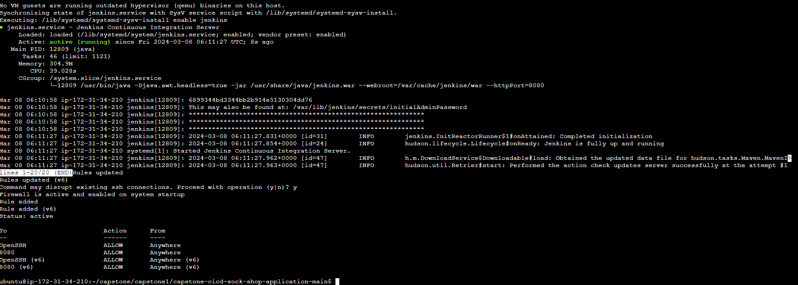

#requirement
you must have a amazon acc
a secret access key 
a security group

#setup 

create an ec2 instance using an instance type wit 2 processors or more 
create the instance 
open the instance 
clone the git repo into a folder
cd into the folder
change the installer.sh file to execuitable (chmod +x installer.sh)
run the (./installer.ch)
acknowledge all prom 
when installation is completed end will come up
press ctrl c and then enter Y

